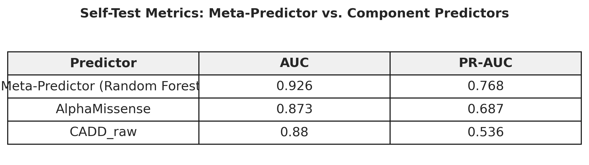
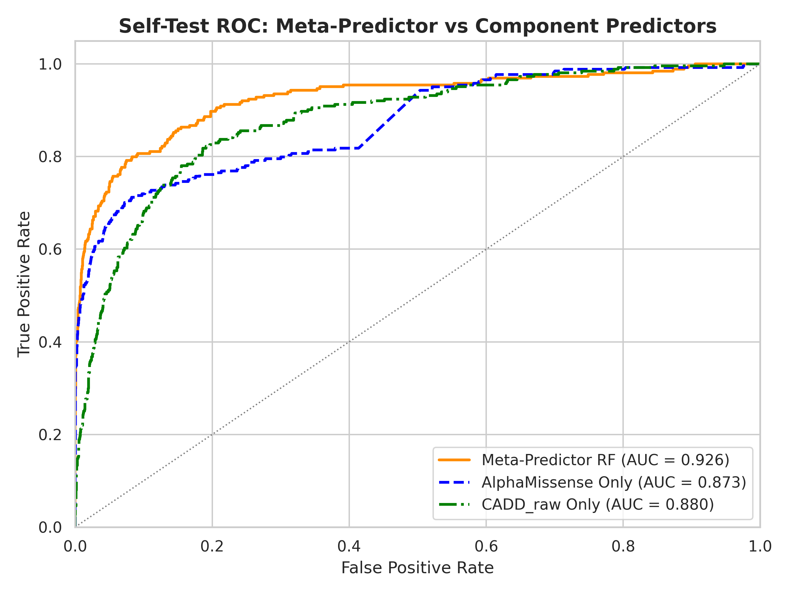
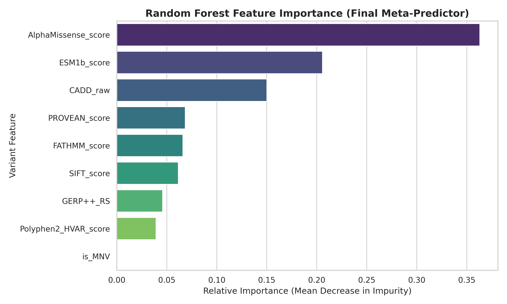
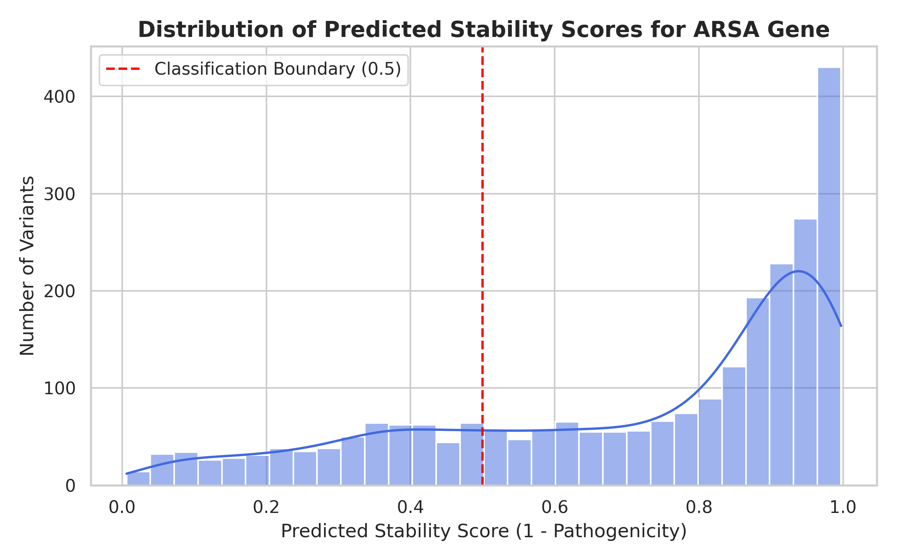

# ARSA Variant Analysis

Machine-learning analysis of ARSA genetic variants using Python and scikit-learn.

This project develops a supervised machine-learning pipeline to classify genetic variants as pathogenic or benign, then applies the resulting model to generate stability-related predictions for ARSA variants.

## Key Results

* **13,464** labeled variants used for model development
* Compared **Random Forest** and **k-Nearest Neighbors (k-NN)**
* **0.940** mean 5-fold cross-validation ROC-AUC for Random Forest
* **0.912** mean 5-fold cross-validation ROC-AUC for k-NN
* **0.926** ROC-AUC on a held-out self-test set
* Generated predictions for **2,491 ARSA variants**

**Technologies:** Python · pandas · NumPy · scikit-learn · Jupyter · Matplotlib · Seaborn

---

## Overview

Genetic variants can affect protein function through a variety of mechanisms. This project uses computational variant annotations and supervised machine learning to distinguish pathogenic from benign variants.

The final model was then applied to ARSA variants for a CAGI submission task, where the required stability-related score was derived from the model's predicted pathogenicity probability.

The project was developed as a computational biology analysis and emphasizes data preprocessing, feature engineering, model comparison, evaluation, and reproducible prediction generation.

---

## Analysis Pipeline

```text
Raw Variant Data
       │
       ▼
Data Loading & Merging
       │
       ▼
Feature Selection
       │
       ▼
Transcript Handling
       │
       ▼
Numeric Conversion
       │
       ▼
Score Direction Normalization
       │
       ▼
MNV Feature Engineering
       │
       ▼
Median Imputation + Scaling
       │
       ▼
┌────────────────────────────┐
│ Random Forest vs. k-NN     │
└────────────────────────────┘
       │
       ▼
5-Fold Cross-Validation
       │
       ▼
Final Random Forest
       │
       ▼
Pathogenicity Probability
       │
       ▼
Stability = 1 − Pathogenicity
       │
       ▼
2,491 ARSA Predictions
```

---

## Dataset

The primary training dataset contains **13,464 labeled genetic variants** with annotation and computational prediction features.

The model uses features derived from multiple computational prediction tools, including:

* AlphaMissense
* CADD
* DANN
* Eigen
* FATHMM
* GERP++
* PROVEAN
* PolyPhen-2
* SIFT

An additional engineered feature identifies multi-nucleotide variants (MNVs).

Raw datasets are intentionally **not included in this repository**.

---

## Feature Engineering & Preprocessing

The input variant annotations required several preprocessing steps before model training.

### Transcript-specific values

Some prediction features contained multiple transcript-specific values in a single field. The pipeline extracts the first available value and converts the resulting feature to numeric form.

### Score direction

Several prediction tools use scores where lower values correspond to greater pathogenicity. These scores were inverted so that the model features consistently follow the same general direction:

> **Higher feature value → greater predicted pathogenicity**

The inverted features were:

* SIFT
* PROVEAN
* FATHMM
* ESM1b

### Multi-nucleotide variants

An `is_MNV` feature was engineered from the reference and alternate sequences to identify variants involving more than one nucleotide.

### Missing values

Missing feature values are handled through **median imputation** within the scikit-learn modeling pipeline.

### Feature scaling

Features are standardized using `StandardScaler` before classification.

Keeping imputation and scaling inside the modeling pipeline ensures that these preprocessing steps are performed within each cross-validation training split rather than using information from the validation fold.

---

## Model Comparison

Two classification approaches were evaluated:

1. **Random Forest**
2. **k-Nearest Neighbors (k-NN)**

Both models were evaluated using **5-fold cross-validation**, with ROC-AUC as the primary metric.

| Model         | Mean 5-Fold ROC-AUC |
| ------------- | ------------------: |
| Random Forest |           **0.940** |
| k-NN          |           **0.912** |

The Random Forest was selected for the final prediction pipeline based on the cross-validation results.

### Model Comparison


-->

---

## Held-Out Evaluation

After model comparison, the Random Forest was evaluated on a held-out self-test set.

The model achieved a ROC-AUC of approximately **0.926**.

For additional context, the self-test analysis also compared the Random Forest against individual computational predictors, including AlphaMissense and CADD.

### ROC / Precision-Recall Evaluation


-->

The similarity between cross-validation performance (**0.940**) and held-out performance (**0.926**) provided a check on the consistency of the model's performance on unseen data.

---

## Feature Importance

Feature-importance analysis indicated that **AlphaMissense, CADD, and GERP++** were among the most influential predictors used by the Random Forest.

### Feature Importance


-->

Feature importance was used as an interpretability tool to examine which computational annotations contributed most strongly to the model's predictions.

---

## ARSA Predictions

The final Random Forest was trained using the full set of labeled training variants.

The model generated pathogenicity probabilities for **2,491 ARSA variants**.

For the CAGI task, the required stability-related score was calculated as:

```text
Stability = 1 − Pathogenicity Probability
```

The resulting predictions were written to the required submission template in TSV format.

### Prediction Distribution


-->

---

## Engineering Decisions

Several design choices were made to make the analysis robust to the structure of the biological data:

* Used a scikit-learn `Pipeline` to combine imputation, scaling, and classification.
* Handled transcript-specific feature values explicitly before numeric conversion.
* Normalized the direction of prediction scores before model training.
* Engineered an MNV indicator from the underlying variant sequences.
* Compared two different classification approaches rather than relying on a single model.
* Used 5-fold cross-validation for model comparison.
* Evaluated the selected model on a held-out self-test set.
* Kept the final prediction pipeline separate from exploratory analysis and visualization.

---

## Limitations

The final stability-related prediction is **not directly trained on experimentally measured protein-stability data**.

Instead, the model is trained to distinguish pathogenic from benign variants, and the resulting pathogenicity probability is transformed into the stability-related score required by the CAGI task.

Pathogenicity and structural protein stability are related but distinct biological concepts. Variants can affect protein function through mechanisms including catalytic activity, metal coordination, multimerization, trafficking, or splicing that are not necessarily captured by a stability-based interpretation.

A future model could incorporate experimentally measured stability data and features designed specifically to model protein stability.

---

## Repository Structure

```text
ARSA_Variant_Analysis/
├── Documents/
│   ├── ARSA_project_report.pdf
│   └── s26-c146-final-project-v12b.pdf
│
├── Notebooks/
│   └── ARSA_analysis.ipynb
│
├── Results/
│   └── Figures/
│       ├── fig1_stability_vs_activity.png
│       ├── fig2_score_distributions.png
│       ├── fig3_selftest_roc.png
│       ├── fig4_feature_importance.png
│       ├── fig4_self_test_metric_table.png
│       ├── fig5_correlation_heatmap.png
│       └── fig6_arsa_predictions_histogram.png
│
├── src/
│   └── arsa_analysis.py
│
├── .gitignore
├── README.md
└── requirements.txt
```

Raw datasets and generated submission files are excluded from version control.

---

## Reproducibility

Install the required Python packages with:

```bash
pip install -r requirements.txt
```

The analysis script expects the required input datasets to be available locally in the `Data/` directory.

The main analysis pipeline can be run with:

```bash
python src/arsa_analysis.py
```

Raw datasets are intentionally excluded from this repository.

---

## AI-Assisted Development

Generative AI was used during development to assist with portions of the Python implementation, debugging, and project development.

Generated code was reviewed, tested, and modified as needed throughout development. The final preprocessing strategy, model comparison, evaluation, interpretation, and submitted results were reviewed by the author.

---

## Project Context

This project was developed as part of a computational biology project involving genetic variant analysis and ARSA-related prediction.

The repository contains the cleaned analysis workflow, supporting documentation, visualizations, and reproducible modeling pipeline developed from the original project.
